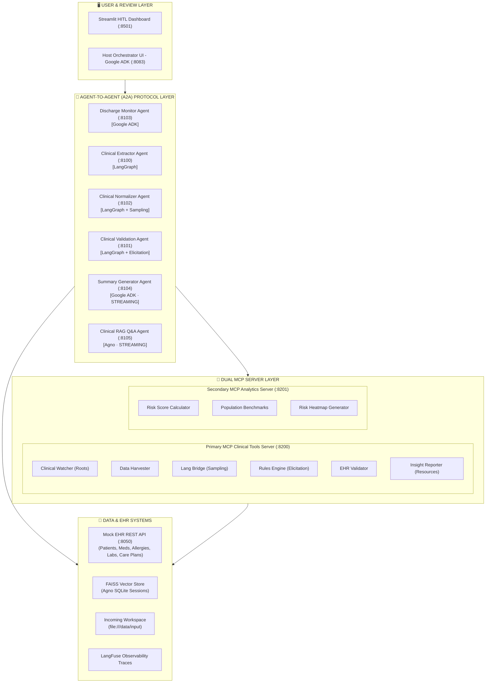

<div align="center">

# 🏥 MediAgent-Nexus
### Multi-Agent Clinical AI Decision Support & Automated Hospital Discharge System

[](https://www.python.org/)
[](https://langchain-ai.github.io/langgraph/)
[](https://ai.google.dev/)
[](https://agno.com/)
[](https://modelcontextprotocol.io/)
[](https://github.com/ULLASCHANDERR/MediAgent-Nexus)
[](https://streamlit.io/)
[](LICENSE)

<p align="center">
  <b>Transforming Hospital Discharge Management through Multi-Framework Agent Coordination, Dual Model Context Protocol (MCP) Servers, A2A Protocol, and Human-in-the-Loop (HITL) Observability.</b>
</p>

</div>

---

## 📑 Table of Contents
- [Executive Overview](#-executive-overview)
- [System Architecture](#-system-architecture)
- [Framework Distribution & Roles](#-framework-distribution--roles)
- [Demonstrating All 6 MCP Primitives](#-demonstrating-all-6-mcp-primitives)
- [Agent-to-Agent (A2A) Protocol](#-agent-to-agent-a2a-protocol)
- [Responsible AI (RAI) Guardrails & Observability](#-responsible-ai-rai-guardrails--observability)
- [Human-in-the-Loop (HITL) Streamlit Dashboard](#-human-in-the-loop-hitl-streamlit-dashboard)
- [Multi-Lingual Patient Test Cases](#-multi-lingual-patient-test-cases)
- [System Port & Microservice Map](#-system-port--microservice-map)
- [Quickstart & Execution](#-quickstart--execution)
- [Verification & Automated Testing](#-verification--automated-testing)
- [Repository Structure](#-repository-structure)
- [License & Authors](#-license--authors)

---

## 🔬 Executive Overview

Hospital discharge summaries are critical clinical handoffs that directly affect patient safety, 30-day readmissions, and billing integrity. However, clinical staff are burdened with fragmented, multi-format documents (PDFs, lab reports, billing statements) written in varying languages (English, Spanish, German, Hindi) with non-standard Latin medical abbreviations (`BID`, `PO`, `QD`, `PRN`).

**MediAgent-Nexus** solves this end-to-end:
1. **Scans & Ingests** incoming patient dossiers across structured and unstructured formats via scoped **MCP Roots**.
2. **Translates & Normalizes** multi-lingual medical text and abbreviation vocabularies using **MCP Sampling** with model hints.
3. **Validates Completeness & Rules** against configurable YAML standards and interactively fills missing data using **MCP Elicitation**.
4. **Cross-Checks against Mock EHR** via REST endpoints to prevent catastrophic drug allergy conflicts, omitted medications, and billing hold-ups.
5. **Answers Questions via 5-Role Agentic RAG** backed by FAISS vector search and evaluated using the **RAG Triad** (Faithfulness, Answer Relevance, Context Relevance).
6. **Delivers Patient-Friendly Summaries** using **A2A Streaming** progressively from patient overview to medications, labs, and red-flag warning signs.
7. **Empowers Clinicians** via a 5-page **Streamlit HITL Workspace** to review, edit medications, override risk levels, and download JSON/HTML/PDF audit packages.

---

## 🏛️ System Architecture



---

## 🤖 Framework Distribution & Roles

| Agent Name | Framework | A2A Port | MCP Primitives | Communication Mode | Key Responsibility |
| :--- | :--- | :---: | :--- | :---: | :--- |
| **Clinical Extractor Agent** | **LangGraph** | `:8100` | Tools + Resources + Prompts | Non-Streaming | StateGraph + MemorySaver extracting demographics, meds, labs, and billing |
| **Clinical Validation Agent** | **LangGraph** | `:8101` | Tools + Elicitation + Resources | Non-Streaming | Verifies completeness against rules.yaml & cross-validates with Mock EHR |
| **Clinical Normalizer Agent** | **LangGraph** | `:8102` | Tools + Sampling + Prompts | Non-Streaming | Multi-lingual translation & Latin medical abbreviation expansion |
| **Discharge Monitor Agent** | **Google ADK** | `:8103` | Tools + Roots | Non-Streaming | Scans input directories registered under MCP Roots with path traversal guard |
| **Discharge Summary Generator** | **Google ADK** | `:8104` | Tools + Prompts | **STREAMING (SSE)** | Section-by-section streaming delivery (patient -> meds -> labs -> bill -> notes) |
| **Clinical RAG Q&A Agent** | **Agno** | `:8105` | MultiMCPTools + Prompts | **STREAMING (SSE)** | 5-role context-aware QA with FAISS vector search, SQLite, & RAG Triad |
| **Host Orchestrator** | **Google ADK** | `:8083` | A2A Client | Non-Streaming + Gradio | End-to-end pipeline execution and monitoring |

---

## 🔌 Demonstrating All 6 MCP Primitives

MediAgent-Nexus fully implements and exercises all **six core Model Context Protocol (MCP) primitives**:

```
           ┌──────────────────────────────────────────────┐
           │          Model Context Protocol (MCP)        │
           └──────────────────────┬───────────────────────┘
          ┌─────────────┬─────────┴───┬─────────────┬─────────────┐
          ▼             ▼             ▼             ▼             ▼
      [ Tools ]   [ Resources ]  [ Prompts ]   [ Sampling ]  [ Elicitation ] [ Roots ]
```

1. 🔧 **Tools**:
   - `clinical_watcher_tool`: Discovers incoming patient records strictly inside declared Roots.
   - `clinical_data_harvester_tool`: Extracts structured clinical text, tables, and billing JSONs.
   - `medical_lang_bridge_tool`: Normalizes multi-lingual terms and medical abbreviations.
   - `clinical_rules_engine_tool`: Validates completeness and triggers Elicitation for missing data.
   - `ehr_validation_tool`: Verifies allergy contradictions, med omissions, and billing status against Mock EHR.
   - `clinical_insight_reporter_tool`: Generates structured audit JSON and clinical HTML summaries.
   - `calculate_risk_score` (Secondary MCP): Calculates composite 0-100 discharge risk score.
   - `get_population_benchmarks` (Secondary MCP): Evaluates 30-day readmission benchmarks by diagnosis.
   - `generate_risk_heatmap` (Secondary MCP): Multi-dimensional risk matrix breakdown.

2. 📦 **Resources**:
   - `resource://clinical-rules/completeness`: Completeness rules from `rules.yaml`
   - `resource://clinical-rules/cross-validation`: Cross-validation rules from `rules.yaml`
   - `resource://discharge-report/{patient_id}`: Raw patient discharge document text
   - `resource://lab-report/{patient_id}`: Raw patient lab report text
   - `resource://report-template/html`: HTML Jinja2 discharge summary template
   - `resource://medical-abbreviations`: Clinical abbreviation dictionary

3. 💬 **Prompts**:
   - `discharge-extraction-prompt`: Parameters `language`, `doc_types`
   - `ehr-cross-validation-prompt`: Parameter `patient_id`
   - `abbreviation-normalization-prompt`: Parameter `source_language`
   - `summary-generation-prompt`: Parameters `risk_level`, `audience`
   - `rag-answer-prompt`: Parameters `context_length`, `question`

4. 🧠 **Sampling**:
   - The `Medical Lang Bridge Tool` issues a `create_message()` sampling request to the calling agent's LLM client, including `ModelPreferences` hints (`nova-lite` for multilingual, `command-r-plus` for English). The calling LangGraph agent implements a `sampling_callback` to route and execute inference cleanly separating LLM resource management from tool logic.

5. ❓ **Elicitation**:
   - When non-blocking fields are missing, `Clinical Rules Engine Tool` triggers `ctx.elicit()` with a Pydantic schema. The HITL Streamlit dashboard renders the form and returns an `ElicitResult` handling all 3 outcomes: `accept`, `decline`, or `cancel`.

6. 📁 **Roots**:
   - The Discharge Monitor Agent registers `file:///data/input` as an authorized Root URI upon connecting. The Clinical Watcher tool calls `ctx.list_roots()` to discover authorized folders at runtime and rejects any path-traversal attempts via `Path.relative_to()`.

---

## 🤝 Agent-to-Agent (A2A) Protocol

All agents in MediAgent-Nexus adhere to the **Agent-to-Agent (A2A) Protocol**:
- **Discovery**: Expose standard `AgentCard` at `GET /.well-known/agent.json`.
- **Security**: Authenticated using shared secret header `X-Agent-Auth-Token: clinical-agentic-secure-token-2026`.
- **Streaming Mode**:
  - `Discharge Summary Generator (:8104)` streams section-by-section summaries: `patient -> meds -> labs -> bill -> instructions`.
  - `Clinical RAG Q&A Agent (:8105)` streams token-by-token answers to the user interface.
- **Client Invocations**: Standardized in `A2AClient` supporting both `send_message()` and async `send_message_streaming()`.

---

## 🛡️ Responsible AI (RAI) Guardrails & Observability

### RAI Guardrails Matrix
| Guardrail | Module | Trigger Condition | Enforcement Action |
| :--- | :--- | :--- | :--- |
| **PII/PHI Redaction** | `PIIRedactor` | Text containing patient name, phone, Aadhaar, PAN, email | Mask before logging or external API calls |
| **Hallucination Check** | `HallucinationChecker` | RAG answer faithfulness score `< 0.70` | Block response and request regeneration |
| **Prompt Injection Guard** | `PromptInjectionGuard` | User query matches jailbreak / injection patterns | Immediate rejection & security alert logging |
| **Toxicity Filter** | `ToxicityFilter` | Toxic or hazardous instructions in generation | Filter harmful terms before summary delivery |
| **HITL Escalation** | `GuardrailManager` | `risk_level == High` or `discharge_blocked == True` | Mandatory human clinician review; blocks auto-approval |

### Grounding & Refusal Guarantee
For out-of-context questions, the Agno RAG agent strictly returns:
> *"I don’t know — this information is not available in the patient records."*

### LangFuse Observability
- End-to-end trace ID per discharge case (`trace-P00X-...`) propagated across all agents.
- Per-agent execution spans (input payloads, output payloads, latencies).
- Per-tool MCP spans (duration, tool parameters, results).
- LLM generation events, sampling events, and elicitation audit logs.

---

## 🖥️ Human-in-the-Loop (HITL) Streamlit Dashboard

Launch the 5-page clinician review workspace on Port `:8501`:

```
┌────────────────────────────────────────────────────────────────────────┐
│                        Hospital HITL Center                            │
├───────────────┬────────────────────────────────────────────────────────┤
│ Page 1        │ 📄 Document Viewer & Ingestion                         │
│               │ - Patient selector (P001 - P004)                       │
│               │ - Multi-lingual badge detection                        │
│               │ - Tab view (Discharge Report, Lab Results, Bill)       │
│               │ - Process trigger button                               │
├───────────────┼────────────────────────────────────────────────────────┤
│ Page 2        │ 🛡️ Clinical & Business Validation Report               │
│               │ - Completeness Score (color-coded)                     │
│               │ - Cross-Validation Discrepancies Table                 │
│               │ - Risk Level Badge & Recommendation                    │
│               │ - Discharge Blocked indicator & LangFuse trace link    │
├───────────────┼────────────────────────────────────────────────────────┤
│ Page 3        │ ✍️ HITL Reviewer Corrections Workspace                 │
│               │ - Editable medication reconciliation (st.data_editor)  │
│               │ - MCP Elicitation form (accept / decline / cancel)     │
│               │ - Clinical risk label override & clinician approval    │
├───────────────┼────────────────────────────────────────────────────────┤
│ Page 4        │ 🤖 Clinical Decision Support RAG (Agno)                │
│               │ - Patient-filtered questions & quick prompt buttons    │
│               │ - Prompt injection alert badge                         │
│               │ - Token-by-token streaming response                    │
│               │ - FAISS source citations & RAG Triad quality metrics   │
├───────────────┼────────────────────────────────────────────────────────┤
│ Page 5        │ 📑 Patient Discharge Summary & Exports                 │
│               │ - Plain-English medication schedule                    │
│               │ - Progressive section-by-section A2A Streaming         │
│               │ - One-click export to JSON, HTML, or PDF               │
└───────────────┴────────────────────────────────────────────────────────┘
```

---

## 🌐 Multi-Lingual Patient Test Cases

| Patient | Primary Language | Clinical Diagnosis | Special Conditions & Test Scenario | Expected Outcome |
| :---: | :---: | :--- | :--- | :---: |
| **P001** | English 🇺🇸 | Type 2 Diabetes Mellitus with Acute Hyperglycemia | Complete documentation, bill PAID, no allergy conflicts | ✅ **Auto-Approved** |
| **P002** | Spanish 🇪🇸 | Acute Coronary Syndrome / NSTEMI | **Allergy Contradiction**: Prescribed Aspirin despite known Aspirin allergy. **Unsettled Bill**: UNPAID without insurance letter | 🚨 **Discharge BLOCKED** (HITL Escalation) |
| **P003** | German 🇩🇪 | Community-Acquired Bacterial Pneumonia | Entlassungsbericht in German, normalized via MCP Sampling, bill PAID | ✅ **Auto-Approved** |
| **P004** | Hindi 🇮🇳 | Hypertensive Crisis with Mild Renal Impairment | Multi-lingual Hindi/English report, normalized to English, renal labs tracked | ✅ **Auto-Approved** |

---

## 🗺️ System Port & Microservice Map

| Service Name | Port | Protocol | Framework | Role / Endpoint |
| :--- | :---: | :---: | :---: | :--- |
| **Mock EHR System** | `:8050` | HTTP/REST | FastAPI | Electronic Health Records API (`/patients`, `/medications`, `/allergies`, `/labs`) |
| **Host Orchestrator** | `:8083` | HTTP + A2A | Google ADK / Gradio | Central agent coordinator & interactive pipeline UI |
| **Clinical Extractor Agent** | `:8100` | A2A Non-Streaming | LangGraph | Entity extraction from clinical texts |
| **Clinical Validation Agent** | `:8101` | A2A Non-Streaming | LangGraph | Completeness & EHR cross-validation |
| **Clinical Normalizer Agent** | `:8102` | A2A Non-Streaming | LangGraph | Language translation & abbreviation normalization |
| **Discharge Monitor Agent** | `:8103` | A2A Non-Streaming | Google ADK | Document repository monitoring via MCP Roots |
| **Summary Generator Agent** | `:8104` | A2A STREAMING (SSE) | Google ADK | Section-by-section progressive discharge summary |
| **Clinical RAG Q&A Agent** | `:8105` | A2A STREAMING (SSE) | Agno | 5-role RAG with FAISS vector search & SQLite memory |
| **Primary MCP Clinical Server** | `:8200` | MCP streamable-HTTP | FastMCP | All 6 MCP Primitives (`/clinicaltools`) |
| **Secondary MCP Analytics Server**| `:8201` | MCP streamable-HTTP | FastMCP | Risk scoring, benchmarks, & risk heatmaps (`/analyticstools`) |
| **Streamlit HITL Dashboard** | `:8501` | HTTP | Streamlit | 5-page clinician review interface |

---

## ⚡ Quickstart & Execution

### 1. Prerequisites
- Python 3.11+
- Virtual environment recommended

### 2. Installation
```bash
git clone https://github.com/ULLASCHANDERR/MediAgent-Nexus.git
cd MediAgent-Nexus

python3 -m venv venv
source venv/bin/activate

pip install -r requirements.txt
```

### 3. Launch All 11 Microservices (One Command)
```bash
python3 run_system.py
```
This orchestrates and initializes all microservices and displays a real-time health matrix in your terminal.

Access points:
- **Streamlit HITL Dashboard**: [http://localhost:8501](http://localhost:8501)
- **Gradio Host Orchestrator**: [http://localhost:8083](http://localhost:8083)
- **Mock EHR Swagger Docs**: [http://localhost:8050/docs](http://localhost:8050/docs)
- **Primary MCP Clinical Tools**: [http://localhost:8200/clinicaltools/resources](http://localhost:8200/clinicaltools/resources)

---

## 🧪 Verification & Automated Testing

Run the automated test suite verifying RAI guardrails, PII redactions, hallucination checks, prompt injection guards, and LangFuse telemetry:

```bash
python3 test_system.py
```

Expected output:
```text
......
----------------------------------------------------------------------
Ran 6 tests in 0.001s

OK
```

---

## 📁 Repository Structure

```text
MediAgent-Nexus/
├── .github/
│   └── workflows/
│       └── ci.yml                     # Continuous Integration workflow
├── configs/
│   ├── rules.yaml                     # Completeness and cross-validation rules
│   ├── prompts.yaml                   # MCP Prompts library
│   └── agent_config.yaml              # Port bindings, auth secrets, models
├── data/
│   ├── input/                         # Multi-lingual raw patient documents
│   │   ├── P001/                      # English dossier (Diabetes)
│   │   ├── P002/                      # Spanish dossier (Cardiology - Allergy Conflict)
│   │   ├── P003/                      # German dossier (Pneumonia)
│   │   └── P004/                      # Hindi dossier (Hypertensive Crisis)
│   ├── mock_ehr/                      # Mock Hospital EHR databases
│   │   ├── patients.json
│   │   ├── medications.json
│   │   ├── allergies.json
│   │   ├── labs.json
│   │   ├── care_plans.json
│   │   └── medical_abbreviations.json
│   ├── vector_db/                     # FAISS index storage & SQLite session DB
│   └── reports/                       # Generated audit reports
├── src/
│   ├── a2a_common/                    # A2A Protocol, AgentCard schemas, client
│   │   ├── protocol.py
│   │   └── client.py
│   ├── agents/                        # Multi-framework AI agents
│   │   ├── extractor_agent.py         # LangGraph Extractor (:8100)
│   │   ├── validation_agent.py        # LangGraph Validator (:8101)
│   │   ├── normalizer_agent.py        # LangGraph Normalizer (:8102)
│   │   ├── monitor_agent.py           # Google ADK Monitor (:8103)
│   │   ├── summary_agent.py           # Google ADK Summary Streaming (:8104)
│   │   ├── rag_agent.py               # Agno 5-Role RAG Streaming (:8105)
│   │   └── host_orchestrator.py       # Google ADK Host Gradio UI (:8083)
│   ├── dashboard/
│   │   └── app.py                     # Streamlit 5-page HITL Dashboard (:8501)
│   ├── guardrails/
│   │   └── rai_guardrails.py          # PII, Hallucination, Prompt Injection, Toxicity
│   ├── mcp_servers/                   # Dual FastMCP Servers
│   │   ├── primary_clinical_server.py # 6 MCP Primitives (:8200)
│   │   └── secondary_analytics_server.py # Analytics MCP Server (:8201)
│   ├── mock_ehr/
│   │   └── app.py                     # Mock EHR FastAPI Server (:8050)
│   └── observability/
│       └── tracker.py                 # LangFuse traces, spans, and telemetry
├── templates/
│   └── discharge_summary_template.html# Clinical Jinja2 HTML summary template
├── .env.example                       # Environment template
├── .gitignore                         # Git exclusion rules
├── CONTRIBUTING.md                    # Contribution guidelines
├── LICENSE                            # MIT License
├── README.md                          # Comprehensive documentation
├── requirements.txt                   # Complete dependencies
├── run_system.py                      # Multi-process system supervisor
└── test_system.py                     # Automated verification test suite
```

---

## 📜 License & Authors

- **Author**: [Ullas Chander](https://github.com/ULLASCHANDERR)
- **Repository**: [https://github.com/ULLASCHANDERR/MediAgent-Nexus](https://github.com/ULLASCHANDERR/MediAgent-Nexus)
- **License**: Released under the [MIT License](LICENSE).
